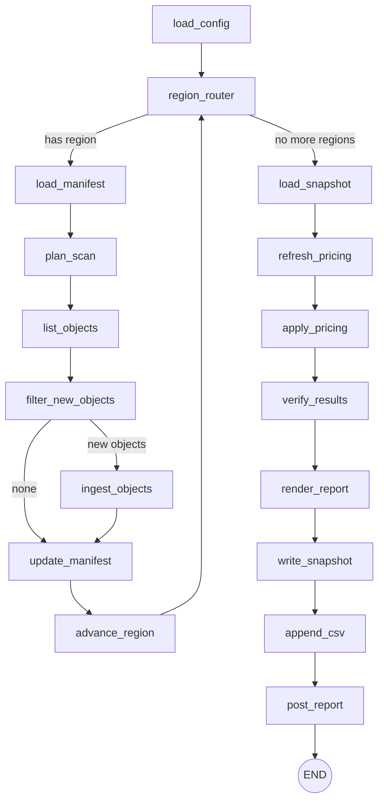

# Boostburn

A LangGraph-based workflow that aggregates AWS Bedrock model invocation logs and emits daily reports to multiple outputs.

## Overview

Boostburn reads Bedrock invocation logs from regional S3 buckets, aggregates token usage and cost metrics, and generates a daily report. It always writes a full-fidelity local snapshot, and can optionally post a Slack summary and append a daily CSV row. It is optimized to avoid re-downloading logs by tracking processed objects in per-region S3 manifest files. When run multiple times for the same date, it automatically merges metrics from previous runs to maintain cumulative daily totals. Environment variables can be loaded from a local `.env` file.

## Pricing Configuration

Boostburn requires explicit pricing for every Claude model version. When AWS releases new model versions (e.g., `claude-haiku-4-5-YYYYMMDD-vX`), update `config/pricing.yaml`. Missing pricing results in $0.00 costs and Slack warnings.

See [Configuration Guide](docs/configuration.md#pricing-maintenance) for details.

## Requirements

- Python 3.13
- AWS credentials with access to the log buckets
- Slack webhook URL (optional, only if you want Slack output)

## Architecture

- **Adapters**
  - `AwsS3Adapter` for S3 list/get/put
  - `SlackWebhookAdapter` for Slack notifications
  - `ReportStore` for local YAML snapshots and optional CSV output
  - `StaticPricingProvider` for model pricing loaded from a YAML table
- **State**
  - S3 manifest per region stores processed object keys and last processed hour
- **Metrics**
  - Totals across all regions
  - Breakdown by region and identity ARN
  - Breakdown by model

## Graph Design

Nodes:

1. Load configuration
2. Region router (loop)
3. Load per-region manifest
4. Plan scan prefixes
5. List S3 objects
6. Filter new objects (branch)
7. Ingest and aggregate
8. Update manifest
9. Advance region counter
10. Load snapshot (merge previous run's metrics for same day)
11. Reload pricing table
12. Apply pricing to metrics
13. Verify totals
14. Render report
15. Write local snapshot
16. Append CSV report (optional)
17. Post Slack report (optional)

Graph requirements satisfied:

- Branching: skip ingestion when no new objects
- Loop: iterates through regions
- Verification: totals cross-check before completion
- Daily aggregation: merges metrics from multiple runs on the same report date

Mermaid diagram:



## Configuration

For detailed configuration instructions, including:

- Regions setup
- Pricing configuration (including inference profile pricing)
- Environment variables
- CLI options
- Daily aggregation behavior

See **[Configuration Documentation](docs/configuration.md)**

## Development

```bash
python3 -m venv .venv
source .venv/bin/activate
pip install -e .
```

Run a daily report:

```bash
boostburn --report-date 2026-02-01
# or, without installing:
python -m boostburn --report-date 2026-02-01
```

Why both work: this repo defines a console script in `pyproject.toml`:

```toml
[project.scripts]
boostburn = "boostburn.cli:main"
```

When you run `pip install -e .`, pip reads that entry and installs a `boostburn` command that calls `boostburn.cli:main`. If you skip installation, `python -m boostburn` runs the package module directly, which also calls the same CLI entrypoint.

### Daily Aggregation

When run multiple times for the same date, Boostburn automatically merges metrics to maintain cumulative daily totals. Use `--force-reprocess` to skip merging and start fresh. See [Configuration Documentation](docs/configuration.md#daily-aggregation) for details.

## Testing and Eval

Run unit tests:

```bash
pytest
```

Run golden set evaluation:

```bash
python evals/evaluator.py
```

## Roadmap

- Troubleshoot records flagged as missing token counts.
- Store state snapshots in S3 to support running from a Lambda function
- Aggregate metrics per week and month
- Additional usage sources beyond Bedrock
- Richer Slack formatting
- LLM powered summary report noting any recent trends or anomalies.

## References

- https://docs.aws.amazon.com/bedrock/latest/userguide/model-invocation-logging.html
